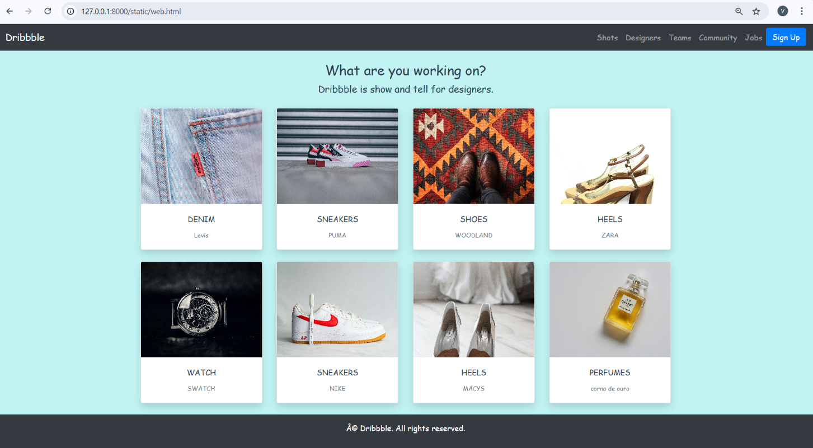

# Project Responsive Web Design using Bootstrap
## Date:

## AIM:
To create a simplified clone of Dribbble (https://dribbble.com/) landing page.


## DESIGN STEPS:

### Step 1:
Clone the repository from GitHub.

### Step 2:
Create Django Admin project.

### Step 3:
Create a New App under the Django Admin project.

### Step 4:
Insert the necessary CSS and JavaScript files as external in order to use Bootstrap.

### Step 5:
Create a HTML file and include the needed Bootstrap components.

### Step 6:
Publish the website in the LocalHost.

## PROGRAM :
```
<html>
<head>
    <title>Dribbble Clone</title>
    <link rel="stylesheet" href="https://stackpath.bootstrapcdn.com/bootstrap/4.5.2/css/bootstrap.min.css">
    <link rel="stylesheet" href="styles.css">
    <style>
        body {
            font-family: cursive;
            margin: 0;
            padding: 0;
            background-color: rgb(193, 243, 243);
            background-size: cover; 
            background-position: center; 
            background-repeat: no-repeat; 
            color: #2c3e50;
        }
        .gallery-item {
            transition: transform 0.3s ease-in-out, box-shadow 0.3s ease;
        }
        .gallery-item:hover {
            transform: scale(1.05);
            box-shadow: 0 4px 10px rgba(0, 0, 0, 0.2);
        }
        .gallery-img {
            width: 100%;
            height: 200px;
            object-fit: cover;
        }
    </style>
    <link href="https://fonts.googleapis.com/css2?family=Pacifico&display=swap" rel="stylesheet">
</head>
<body>
    <nav class="navbar navbar-expand-lg navbar-dark bg-dark">
        <a class="navbar-brand" href="#">Dribbble</a>
        <button class="navbar-toggler" type="button" data-toggle="collapse" data-target="#navbarNav" aria-controls="navbarNav" aria-expanded="false" aria-label="Toggle navigation">
            <span class="navbar-toggler-icon"></span>
        </button>
        <div class="collapse navbar-collapse" id="navbarNav">
            <ul class="navbar-nav ml-auto">
                <li class="nav-item"><a class="nav-link" href="#">Shots</a></li>
                <li class="nav-item"><a class="nav-link" href="#">Designers</a></li>
                <li class="nav-item"><a class="nav-link" href="#">Teams</a></li>
                <li class="nav-item"><a class="nav-link" href="#">Community</a></li>
                <li class="nav-item"><a class="nav-link" href="#">Jobs</a></li>
                <li class="nav-item"><a class="btn btn-primary" href="#">Sign Up</a></li>
            </ul>
        </div>
    </nav>

    <div class="container mt-4">
        <div class="text-center mb-4 header-section">
            <h3>What are you working on?</h3>
            <p class="lead">Dribbble is show and tell for designers.</p>
        </div>

        <div class="row gallery-section">
            <div class="col-md-3 col-sm-6 mb-4">
                <div class="card shadow gallery-item">
                    
                    <div class="card-body text-center">
                        <p class="card-title">DENIM</p>
                        <small class="text-muted">Levis</small>
                    </div>
                </div>
            </div>
            <div class="col-md-3 col-sm-6 mb-4">
                <div class="card shadow gallery-item">
                    
                    <div class="card-body text-center">
                        <p class="card-title">SNEAKERS</p>
                        <small class="text-muted">PUMA</small>
                    </div>
                </div>
            </div>
            <div class="col-md-3 col-sm-6 mb-4">
                <div class="card shadow gallery-item">
                    
                    <div class="card-body text-center">
                        <p class="card-title">SHOES</p>
                        <small class="text-muted">WOODLAND</small>
                    </div>
                </div>
            </div>
            <div class="col-md-3 col-sm-6 mb-4">
                <div class="card shadow gallery-item">
                    
                    <div class="card-body text-center">
                        <p class="card-title">HEELS</p>
                        <small class="text-muted">ZARA</small>
                    </div>
                </div>
            </div>
            <div class="col-md-3 col-sm-6 mb-4">
                <div class="card shadow gallery-item">
                    
                    <div class="card-body text-center">
                        <p class="card-title">WATCH</p>
                        <small class="text-muted">SWATCH</small>
                    </div>
                </div>
            </div>
            <div class="col-md-3 col-sm-6 mb-4">
                <div class="card shadow gallery-item">
                    
                    <div class="card-body text-center">
                        <p class="card-title">SNEAKERS</p>
                        <small class="text-muted">NIKE</small>
                    </div>
                </div>
            </div>
            <div class="col-md-3 col-sm-6 mb-4">
                <div class="card shadow gallery-item">
                    
                    <div class="card-body text-center">
                        <p class="card-title">HEELS</p>
                        <small class="text-muted">MACYS</small>
                    </div>
                </div>
            </div>
            <div class="col-md-3 col-sm-6 mb-4">
                <div class="card shadow gallery-item">
                    
                    <div class="card-body text-center">
                        <p class="card-title">PERFUMES</p>
                        <small class="text-muted">corno de ouro</small>
                    </div>
                </div>
            </div>
        </div>
    </div>

    <footer class="bg-dark text-white text-center py-3">
        <p>© Dribbble. All rights reserved.</p>
    </footer>
    <script src="https://code.jquery.com/jquery-3.5.1.min.js"></script>
    <script src="https://stackpath.bootstrapcdn.com/bootstrap/4.5.2/js/bootstrap.bundle.min.js"></script>
</body>
</html>

```

## OUTPUT:


## RESULT:
The Project for responsive web design using Bootstrap is completed successfully.
